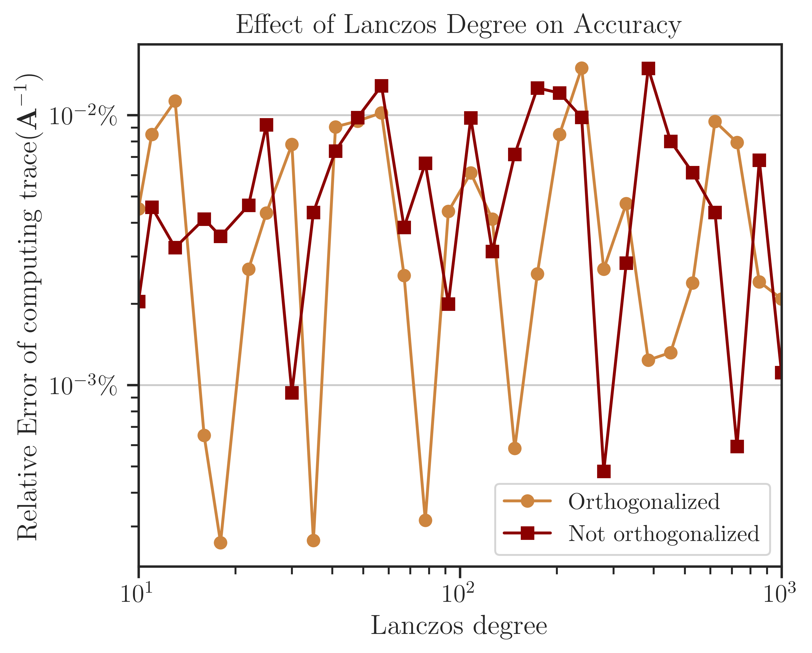

.. _perf-algorithms:

Comparison of Randomized Algorithms
***********************************

|project| implements various deterministic and randomized algorithms on dense and sparse matrices. The goal of the following numerical experiments is to compare the performance, scalability, and accuracy of these algorithms.

Test Description
================

The following numerical experiments aims to estimate

.. math::
    :label: logdet3
    
    \log \det (\mathbf{A}),

and

.. math::
    :label: traceinv3
    
    \mathrm{trace}(\mathbf{A}^{-1}),

where :math:`\mathbf{A}` is symmetric and positive-definite. The above quantities are computationally expensive expressions that frequently appears in the likelihood functions and their Jacobian and Hessian.

Algorithms
----------

The following Algorithms were tested on Intel® Xeon CPU E5-2670 v3  with 24 threads.

.. glossary::

    Cholesky Decomposition

        This method is implemented by the following functions:

        * :ref:`imate.logdet.cholesky` to compute :math:numref:`logdet3`.

        * :ref:`imate.traceinv.cholesky` to compute :math:numref:`traceinv3`.

        The complexity of computing :math:numref:`logdet3` for matrices obtained from 1D, 2D, and 3D grids are respectively :math:`\mathcal{O}(n)`, :math:`\mathcal{O}(n^{\frac{3}{2}})`, and :math:`\mathcal{O}(n^2)` where :math:`n` is the matrix size. The complexity of computing :math:numref:`traceinv3` for sparse matrices is :math:`\mathcal{O}(\rho n^2)` where :math:`\rho` is the sparse matrix density.

    Hutchinson Algorithm

        This method is only applied to :math:numref:`traceinv3` and implemented by :ref:`imate.traceinv.hutchinson` function. The complexity of this method is:

        .. math::
            :label: comp-hutch-alg

            \mathcal{O}(\mathrm{nnz}(\mathbf{A})s),

        where :math:`s` is the number of Monte-Carlo iterations in the algorithm and :math:`\rho` is the sparse matrix density. In this experiment, :math:`s = 80`.

    Stochastic Lanczos Quadrature Algorithm

        This method is implemented by:

        * :ref:`imate.logdet.cholesky` to compute :math:numref:`logdet3`.
        * :ref:`imate.traceinv.cholesky` to compute :math:numref:`traceinv3`.

        The complexity of this method is:

        .. math::
            :label: comp-slq-alg

            \mathcal{O} \left( (\mathrm{nnz}(\mathbf{A}) l + n l^2) s \right),

        where :math:`l` is the number of Lanczos iterations, and :math:`s` is the number of Monte-Carlo iterations.  The numerical experiment is performed with :math:`l=80` and :math:`s=200`. 

Arithmetic Types
----------------

The benchmark test also examines the performance and accuracy of |project| on various arithmetic types of the matrix data. To this end, the matrices that are described below are re-cast into 32-bit, 64-bit, and 128-bit floating point types.

.. note::

    Supporting 128-bit data types is one of the features of |project|, which is often not available in numerical libraries, such as BLAS, OpenBLAS, Cholmod, etc.

.. _simple_mat:

Test on Simple Matrices
=======================

The Gramian matrix :math:`\mathbf{A} = \mathbf{B}^{\intercal} \mathbf{B}` is considered for the test where :math:`\mathbf{B}` is a sparse bi-diagonal Toeplitz matrix defined by

.. math::

    B_{ij} =
    \begin{cases}
        a, & i = j, \\
        b, & i+1 = j.
    \end{cases}

The above matrix can be generated by :func:`imate.toeplitz` function. In this experiment, :math:`a = 2`, :math:`b = 1`, and the matrix size is varied by powers of two, :math:`n = 2^8, 2^9, \dots, 2^{14}`.

The Cholesky factor of :math:`\mathbf{A}` is :math:`\mathbf{B}^{\intercal}`. Also, :math:`\mathrm{nnz}(\mathbf{A}) = 3n`. An advantage of using the above matrix is that an analytic formula for :math:numref:`logdet3` and :math:numref:`traceinv3` is known. Namely,

.. math::
   :label: formula-logdet3

    \log \det \mathbf{A} = 2n \log_e a.

See :func:`imate.sample_matrices.toeplitz_logdet` for details. Also, if :math:`n \gg 1`, then

.. math::
   :label: formula-traceinv3

    \mathrm{trace}(\mathbf{A}^{-1}) \approx \frac{1}{a^2 - b^2} \left( n - \frac{q^{2}}{1 - q^2} \right),

where :math:`q = b/a`. See :func:`imate.sample_matrices.toeplitz_traceinv` for details. The above analytic formulas are used as the benchmark solution to test the accuracy of the results.

Elapsed Time of Computing Log-Determinant
-----------------------------------------

The elapsed (wall) time of the computations is shown in the figure below. The Cholesky method is faster than the SLQ method by an order of magnitude, hence it could be considered the preferred algorithm to compute log-determinant.

For large matrix sizes, :math:`n \geq 2^{19}`, the elapsed time can be related to the matrix size as :math:`t \propto n^{\alpha}`. It can be seen from the slope of the fitted lines in the figure that for the SLQ method, :math:`\alpha` is close to 1. This result is consistent with the analytic complexity :math:`\mathcal{O}(n)` derived from :math:numref:`comp-slq-alg` and using :math:`\mathrm{nnz}(\mathbf{A}) \sim n` for a tri-diagonal matrix. Similarly, for the Cholesky method, :math:`\alpha \approx 1`, which corresponds to the analytic complexity of computing log-determinant for matrices obtained from 1D meshes.

.. image:: ../_static/images/performance/compare_methods_analytic_matrix_logdet_time.png
   :align: center
   :height: 375
   :class: custom-dark

.. note::

    The Cholesky method :ref:`imate.logdet.cholesky` uses `logdet <https://scikit-sparse.readthedocs.io/en/latest/cholmod.html#sksparse.cholmod.Factor.logdet>`_ function from SuiteSparse's Cholmod library, which only supports 64-bit data types. Because of this, the performance test for 32-bit and 128-bit is not available. In contrast, |project|'s implementation of randomized algorithms supports all data types shown in the above figure.

Accuracy of Computing Log-Determinant
-------------------------------------

The error of computing :math:numref:`logdet3` is shown in the figure below, which is obtained by comparing the results with the benchmark solution :math:numref:`formula-logdet3`. The error of the Cholesky method is close to the machine precision (almost zero) since it is a direct method. On the other hand, the error of the `SLQ` method, as a randomized algorithm, is non-zero, yet very small. Such a remarkably small error of the SLQ method is due to the specific matrix used in the test and can be explained by the localized distribution of the eigenvalues of :math:`\mathbf{A}` which makes the SLQ method very effective in estimating :math:numref:`logdet3` with only a few Lanczos iterations. However, for practical matrices, usually, the error of randomized methods is larger than the figure below.

.. image:: ../_static/images/performance/compare_methods_analytic_matrix_logdet_accuracy.png
   :align: center
   :height: 375
   :class: custom-dark

Elapsed Time of Computing Trace of Inverse
------------------------------------------

The elapsed (wall) time of the computations is shown in the figure below. Unlike the above results for log-determinant, the Cholesky method here is significantly slower than the SLQ method. In fact, computing the trace of inverse of matrices is one of the applications where the performance of randomized methods surpasses the direct methods significantly.

The computational complexity can be quantified by the relation between the elapsed time and the matrix size as :math:`t \propto n^{\alpha}`. It can be seen from the slope of the fitted lines in the figure that for Hutchinson and SLQ methods, :math:`\alpha` is close to 1. This result is consistent with the analytic complexity :math:`\mathcal{O}(n)` derived from :math:numref:`comp-hutch-alg` and :math:numref:`comp-slq-alg` and using :math:`\mathrm{nnz}(\mathbf{A}) \sim n` for a tri-diagonal matrix. Similarly, for the Cholesky method, :math:`\alpha \approx 2`, which corresponds to the analytic complexity :math:`\mathcal{O}(n^2)` for computing the trace of matrix inverse.

.. image:: ../_static/images/performance/compare_methods_analytic_matrix_traceinv_time.png
   :align: center
   :class: custom-dark

Accuracy of Computing Trace of Inverse
---------------------------------------

The error of computing :math:numref:`traceinv3` is obtained from the benchmark solution :math:numref:`formula-traceinv3` and shown in the figure below. The error of the Cholesky method is close to the machine precision (almost zero) since it is a direct method. On the other hand, the `SLQ` method, as a randomized algorithm, is non-zero. As mentioned previously, such a remarkable small error of the SLQ method is due to the specific matrix :math:`\mathbf{A}` used in the test as its eigenvalues have a localized distribution, allowing the SLQ method to estimate :math:numref:`traceinv3` with a few Lanczos iterations.

.. image:: ../_static/images/performance/compare_methods_analytic_matrix_traceinv_accuracy.png
   :align: center
   :height: 375
   :class: custom-dark

.. _prac_mat:

Test on Practical Matrices
==========================

The performance of algorithms was also examined on practical matrices. The table below shows the practical matrices used in the test, which are chosen from `SuiteSparse Matrix Collection <https://sparse.tamu.edu>`_ and are obtained from real applications. The matrices in the table below are all symmetric positive-definite. The number of nonzero elements (nnz) of these matrices increases approximately by a factor of 5 on average and their sparse density remains at the same order of magnitude (except for the first three).

.. table::
   :class: right2 right3

   =================  =========  ===========  =======  ============================
   Matrix Name             Size  nnz          Density  Application
   =================  =========  ===========  =======  ============================
   |nos5|_                  468        5,172  0.02     Structural Problem
   |mhd4800b|_            4,800       27,520  0.001    Electromagnetics
   |bodyy6|_             19,366      134,208  0.0003   Structural Problem
   |G2_circuit|_        150,102      726,674  0.00003  Circuit Simulation
   |parabolic_fem|_     525,825    3,674,625  0.00001  Computational Fluid Dynamics
   |StocF-1465|_      1,465,137   21,005,389  0.00001  Computational Fluid Dynamics 
   |Bump_2911|_       2,911,419  127,729,899  0.00001  Structural Problem
   |Queen_4147|_      4,147,110  329,499,284  0.00002  Structural Problem
   =================  =========  ===========  =======  ============================

.. |nos5| replace:: ``nos5``
.. _nos5: https://sparse.tamu.edu/HB/nos5
.. |mhd4800b| replace:: ``mhd4800b``
.. _mhd4800b: https://sparse.tamu.edu/Bai/mhd4800b
.. |bodyy6| replace:: ``bodyy6``
.. _bodyy6: https://sparse.tamu.edu/Pothen/bodyy6
.. |G2_circuit| replace:: ``G2_circuit``
.. _G2_circuit: https://sparse.tamu.edu/AMD/G2_circuit
.. |parabolic_fem| replace:: ``parabolic_fem``
.. _parabolic_fem: https://sparse.tamu.edu/Wissgott/parabolic_fem
.. |StocF-1465| replace:: ``StocF-1465``
.. _StocF-1465: https://sparse.tamu.edu/Janna/StocF-1465
.. |Bump_2911| replace:: ``Bump_2911``
.. _Bump_2911: https://sparse.tamu.edu/Janna/Bump_2911
.. |Queen_4147| replace:: ``Queen_4147``
.. _Queen_4147: https://sparse.tamu.edu/Janna/Queen_4147

Process Time of Computing Log-Determinant
-----------------------------------------

The elapsed (wall) time of the computations is shown in the figure below. Unlike the results of the Toeplitz matrices, here, the result of comparing the Cholesky method and SLQ method is mixed with the Cholesky method often being marginally faster than the SLQ method. However, the SLQ method is scalable to larger matrices, whereas the Cholesky method often crashes at :math:`n > 10^8`.

.. image:: ../_static/images/performance/compare_methods_practical_matrix_logdet_time.png
   :align: center
   :class: custom-dark
   
Accuracy of Computing Log-Determinant
-------------------------------------

The error of computing log-determinant using the SLQ method is shown in the figure below, which is obtained by comparing with the result of the Cholesky method as a benchmark. For four of the matrices, the error is less than :math:`1 \%`. However, for the second and the sixth matrices in the figure, the error is above :math:`10 \%`. To reduce the error, a higher number of Monte-Carlo iterations are needed on these matrices.

.. image:: ../_static/images/performance/compare_methods_practical_matrix_logdet_accuracy.png
   :align: center
   :height: 375
   :class: custom-dark

Varying Algorithm Parameters
============================

A known issue of the Lanczos algorithm is that the eigenvectors computed during the recusance Lanczos iterations lose their orthogonality. A solution to this issue is the re-orthogonalization of the newly computed eigenvectors with either some or all previous eigenvectors, which is known as partial or full orthogonalization, respectively. |project| supports both types of orthogonalization techniques.

In the following tests, the effect of re-orthogonalizations of the eigenvectors and the effect of varying the number of Lanczos iterations are examined.

Process Time of Computing Log-Determinant
-----------------------------------------

The test below corresponds to the tri-diagonal matrix :math:`\mathbf{A}` (See :ref:`Test on Simple Matrices <simple_mat>`) with :math:`n = 2^{14}`. The figure below shows the elapsed time (left) and process time (right) of computing the log-determinant versus the number of Lanczos iterations, :math:`l` (also known as Lanczos degree). The orange and red curves respectively show the results with and without orthogonalization of the eigenvectors in the Lanczos algorithm. The processing time is proportional to :math:`\mathcal{O}(l)` without orthogonalization, which is consistent with the complexity given in :math:numref:`comp-slq-alg` when :math:`\mathrm{nnz}(\mathbf{A})` is large. However, the processing time is almost :math:`\mathcal{O}(l^{2})` with orthogonalization for :math:`l < 300`, which is consistent with the complexity of the Gram-Schmit orthogonalization process.

.. image:: ../_static/images/performance/vary_lanczos_degree_analytic_matrix_time.png
   :align: center
   :class: custom-dark

Note that at :math:`l > 300`, the processing time suddenly increases. This effect does not reflect a mathematical complexity, rather, is due to the fact that the Gram-Schmidt process is a memory-bounded process when the number of vectors is large. Specifically, when *full-orthogonalization* is used, all previous eigenvectors of the Lanczos iterations should be stored on the memory in a single large array. However, by increasing the number of eigenvectors, the size of the arrays grows larger than the memory bandwidth of the CPU cache, making the memory access significantly inefficient. 

Accuracy of Computing Log-Determinant
-------------------------------------

The figure below shows the error of computing log-determinant by comparing the results with the analytic value in :math:numref:`formula-logdet3`. While the full-orthogonalization process in the Lanczos algorithm is an order of magnitude slower than without using orthogonalization, it provides a higher accuracy by an order of magnitude. The figure also implies that only a few Lanczos iterations, :math:`l = 30 \sim 60` are sufficient to obtain a reasonable order of accuracy. This result holds for most applications.

Process Time of Computing Trace of Inverse
------------------------------------------

The above tests were also performed on the practical matrices (see :ref:`Test on Practical Matrices <prac_mat>`). The figure below corresponds to computing the race of inverse of the matrix `jnlbrng1 <http://sparse.tamu.edu/GHS_psdef/jnlbrng1>`_ with :math:`n = 40000`. The results are very similar to the previous test on simple matrices. Namely, the complexity of the process with and without orthogonalization is :math:`\mathcal{O}(l^2)` and :math:`\mathcal{O}(l)`, respectively. Also, orthogonalization is by an order of magnitude slower than without orthogonalization and the effect of the cache memory bandwidth can be seen at :math:`l > 300`.;

.. image:: ../_static/images/performance/vary_lanczos_degree_practical_matrix_time.png
   :align: center
   :class: custom-dark

Accuracy of Computing Trace of Inverse
--------------------------------------

The error of computing the trace of inverse of the test matrix is shown below, which is obtained by comparison of the results with the Cholesky method (not shown here). The difference between the error of the process with and without orthogonalization is insignificant, hence, one may not use orthogonalization as it is effectively faster. Also, as suggested by the figure's results, a practical choice for the number of Lanczos iterations is :math:`l = 20 \sim 50` for most applications.

.. image:: ../_static/images/performance/vary_lanczos_degree_practical_matrix_accuracy.png
   :align: center
   :height: 340
   :class: custom-dark

How to Reproduce Results
========================

Prepare Matrix Data
-------------------

1. Download all the above-mentioned sparse matrices from `SuiteSparse Matrix Collection <https://sparse.tamu.edu>`_. For instance, download ``Queen_4147.mat`` from |Queen_4147|_.
2. Run |read_matrix_m|_ to extract sparse matrix data from ``Queen_4147.mat``:

   .. code-block:: matlab

        read_matrix('Queen_4147.mat');

3. Run |read_matrix_py|_ to convert the outputs of the above script to generate a python pickle file:

   .. prompt:: bash

        read_matrix.py Queen_4147 float32    # to generate 32-bit data
        read_matrix.py Queen_4147 float64    # to generate 64-bit data
        read_matrix.py Queen_4147 float128   # to generate 128-bit data

   The output of the above script will be written in |matrices|_.

Perform Numerical Test
----------------------

Run Locally
~~~~~~~~~~~

* Run |comp_analytic_py|_ to reproduce results for Toeplitz matrices as follows
  
     .. prompt:: bash
    
         cd /imate/benchmark/scripts
         python ./compare_methods_analytic_matrix.py -a -f logdet     # log-determinant test
         python ./compare_methods_analytic_matrix.py -a -f traceinv   # trace of inverse test
  
* Run |comp_practical_py|_ to reproduce results for practical matrices as follows
  
     .. prompt:: bash
    
         cd /imate/benchmark/scripts
         python ./compare_methods_practical_matrix.py -a -f logdet     # log-determinant test
  
* Run |vary_analytic_py|_ to reproduce results for varying algorithm parameters on simple matrices:
  
     .. prompt:: bash
    
         cd /imate/benchmark/scripts
         python ./vary_lanczos_degree_analytic_matrix.py 
  
* Run |vary_practical_py|_ to reproduce results for varying algorithm parameters on practical matrices:
  
     .. prompt:: bash
    
         cd /imate/benchmark/scripts
         python ./vary_lanczos_degree_practical_matrix.py 

Submit to Cluster with SLURM
~~~~~~~~~~~~~~~~~~~~~~~~~~~~

* Submit |jobfile_comp_analytic_logdet|_ to reproduce results of log-determinant of simple matrices:
  
     .. prompt:: bash
    
         cd /imate/benchmark/jobfiles
         sbatch ./jobfile_compare_methods_analytic_matrix_logdet.sh

* Submit |jobfile_comp_analytic_traceinv|_ to reproduce results of the trace of inverse of simple matrices:
  
     .. prompt:: bash
    
         cd /imate/benchmark/jobfiles
         sbatch ./jobfile_compare_methods_analytic_matrix_traceinv.sh

* Submit |jobfile_comp_practical_logdet|_ to reproduce results of log-determinant of simple matrices:
  
     .. prompt:: bash
    
         cd /imate/benchmark/jobfiles
         sbatch ./jobfile_compare_methods_practical_matrix_logdet.sh

* Submit |jobfile_vary_analytic|_ to reproduce results of varying parameters on simple matrices:
  
     .. prompt:: bash
    
         cd /imate/benchmark/jobfiles
         sbatch ./jobfile_vary_lanczos_degree_analytic_matrix.sh

* Submit |jobfile_vary_practical|_ to reproduce results of varying parameters on practical matrices:
  
     .. prompt:: bash
    
         cd /imate/benchmark/jobfiles
         sbatch ./jobfile_vary_lanczos_degree_practical_matrix.sh

Plot Results
------------

* Run |notebook_comp_analytic_logdet|_ to generate plots for computing the log-determinants of Toeplitz matrices.
* Run |notebook_comp_analytic_traceinv|_ to generate plots for computing the trace of inverse of Toeplitz matrices.
* Run |notebook_comp_practical_logdet|_ to generate plots for computing the log-determinants of the practical matrices.
* Run |notebook_vary_analytic|_ to generate plots for varying algorithm parameters on Toeplitz matrices.
* Run |notebook_vary_practical|_ to generate plots for varying algorithm parameters on practical matrices.

These notebooks stores the plots as `svg` files in |svg_plots|_.
    
.. |read_matrix_m| replace:: ``/imate/benchmark/matrices/read_matrix.m``
.. _read_matrix_m: https://github.com/ameli/imate/blob/main/benchmark/matrices/read_matrix.m

.. |read_matrix_py| replace:: ``/imate/benchmark/matrices/read_matrix.py``
.. _read_matrix_py: https://github.com/ameli/imate/blob/main/benchmark/matrices/read_matrix.py

.. |matrices| replace:: ``/imate/benchmark/matrices/``
.. _matrices: https://github.com/ameli/imate/blob/main/benchmark/matrices

.. |comp_analytic_py| replace:: ``/imate/benchmark/scripts/compare_methods_analytic_matrix.py``
.. _comp_analytic_py: https://github.com/ameli/imate/blob/main/benchmark/scripts/compare_methods_analytic_matrix.py

.. |comp_practical_py| replace:: ``/imate/benchmark/scripts/compare_methods_practical_matrix.py``
.. _comp_practical_py: https://github.com/ameli/imate/blob/main/benchmark/scripts/compare_methods_practical_matrix.py

.. |vary_analytic_py| replace:: ``/imate/benchmark/scripts/vary_lanczos_degree_analytic_matrix.py``
.. _vary_analytic_py: https://github.com/ameli/imate/blob/main/benchmark/scripts/vary_lanczos_degree_analytic_matrix.py

.. |vary_practical_py| replace:: ``/imate/benchmark/scripts/vary_lanczos_degree_practical_matrix.py``
.. _vary_practical_py: https://github.com/ameli/imate/blob/main/benchmark/scripts/vary_lanczos_degree_practical_matrix.py

.. |jobfile_comp_analytic_logdet| replace:: ``/imate/benchmark/scripts/jobfile_compare_methods_analytic_matrix_logdet.sh``
.. _jobfile_comp_analytic_logdet: https://github.com/ameli/imate/blob/main/benchmark/jobfiles/jobfile_compare_methods_analytic_matrix_logdet.sh

.. |jobfile_comp_analytic_traceinv| replace:: ``/imate/benchmark/scripts/jobfile_compare_methods_analytic_matrix_traceinv.sh``
.. _jobfile_comp_analytic_traceinv: https://github.com/ameli/imate/blob/main/benchmark/jobfiles/jobfile_compare_methods_analytic_matrix_traceinv.sh

.. |jobfile_comp_practical_logdet| replace:: ``/imate/benchmark/scripts/jobfile_compare_methods_practical_matrix_logdet.sh``
.. _jobfile_comp_practical_logdet: https://github.com/ameli/imate/blob/main/benchmark/jobfiles/jobfile_compare_methods_practical_matrix_logdet.sh

.. |jobfile_vary_analytic| replace:: ``/imate/benchmark/scripts/jobfile_vary_lanczos_degree_analytic_matrix.sh``
.. _jobfile_vary_analytic: https://github.com/ameli/imate/blob/main/benchmark/jobfiles/jobfile_vary_lanczos_degree_analytic_matrix.sh

.. |jobfile_vary_practical| replace:: ``/imate/benchmark/scripts/jobfile_vary_lanczos_degree_practical_matrix.sh``
.. _jobfile_vary_practical: https://github.com/ameli/imate/blob/main/benchmark/jobfiles/jobfile_vary_lanczos_degree_practical_matrix.sh

.. |notebook_comp_analytic_logdet| replace:: ``/imate/benchmark/notebooks/plot_compare_methods_analytic_matrix_logdet.ipynb``
.. _notebook_comp_analytic_logdet: https://github.com/ameli/imate/blob/main/benchmark/notebooks/plot_compare_methods_analytic_matrix_logdet.ipynb

.. |notebook_comp_analytic_traceinv| replace:: ``/imate/benchmark/notebooks/plot_compare_methods_analytic_matrix_traceinv.ipynb``
.. _notebook_comp_analytic_traceinv: https://github.com/ameli/imate/blob/main/benchmark/notebooks/plot_compare_methods_analytic_matrix_traceinv.ipynb

.. |notebook_comp_practical_logdet| replace:: ``/imate/benchmark/notebooks/plot_compare_methods_analytic_matrix_logdet.ipynb``
.. _notebook_comp_practical_logdet: https://github.com/ameli/imate/blob/main/benchmark/notebooks/plot_compare_methods_analytic_matrix_logdet.ipynb

.. |notebook_vary_analytic| replace:: ``/imate/benchmark/notebooks/plot_vary_lanczos_degree_analytic_matrix.ipynb``
.. _notebook_vary_analytic: https://github.com/ameli/imate/blob/main/benchmark/notebooks/plot_vary_lanczos_degree_analytic_matrix.ipynb

.. |notebook_vary_practical| replace:: ``/imate/benchmark/notebooks/plot_vary_lanczos_degree_practical_matrix.ipynb``
.. _notebook_vary_practical: https://github.com/ameli/imate/blob/main/benchmark/notebooks/plot_vary_lanczos_degree_practical_matrix.ipynb

.. |svg_plots| replace:: ``/imate/benchmark/svg_plots/``
.. _svg_plots: https://github.com/ameli/imate/blob/main/benchmark/svg_plots
