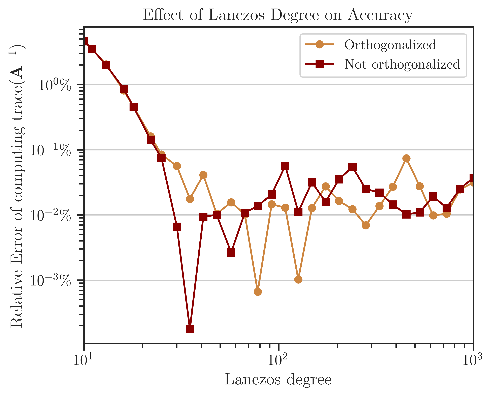

.. _perf-algorithms:

Comparison of Randomized Algorithms
***********************************

|project| implements various deterministic and randomized algorithms on dense and sparse matrices. The goal of the following numerical experiments is to compare the performance, scalability, and accuracy of these algorithms.

Test Description
================

In the following numerical experiments compute

.. math::
    :label: logdet3
    
    \log \det (\mathbf{A}),

and

.. math::
    :label: traceinv3
    
    \mathrm{trace}(\mathbf{A}^{-1}),

where :math:`\mathbf{A}` is symmetric and positive-definite. The above quantities is a computationally expensive expression that frequently appears in the likelihood funcitons and their Jacobian and Hessian.

Algorithms
----------

The following Algorithms were tested on Intel(R) Xeon(R) CPU E5-2670 v3  with 24 threads.

.. glossary::

    Cholesky Decomposition

        This method is implemented by the following functions:

        * :ref:`imate.logdet.cholesky` to compute :math:numref:`logdet3`.

        * :ref:`imate.traceinv.cholesky` to compute :math:numref:`traceinv3`.

        The complexity of computing :math:numref:`logdet3` is close to :math:`\mathcal{O}((\mathrm{nnz}(\mathbf{L}))^{\frac{3}{2}})` (see for instance [1]_) where :math:`\mathbf{A} = \mathbf{L} \mathbf{L}^{\intercal}`. The complexity of computing :math:numref:`traceinv3` for sparse matrices is :math:`\mathcal{O}(n^2)` where :math:`n` is the matrix size.

    Hutchinson Method

        This method is only applied to :math:numref:`traceinv3` and implemented by :ref:`imate.traceinv.hutchinson` fucntion. The complexity of this method is:

        .. math::

            \mathcal{O}(\mathrm{nnz}(\mathbf{A})s),

        where :math:`s` is the number of Monte-Carlo iterations in the algorithm and :math:`\rho` is the sparse matrix density. In this experiemnt, :math:`s = 80`.

    Stochastic Lanczos Quadrature Method

        This method is implemented by:

        * :ref:`imate.logdet.cholesky` to compute :math:numref:`logdet3`.
        * :ref:`imate.traceinv.cholesky` to compute :math:numref:`traceinv3`.

        The complexity of this method is:

        .. math::

            \mathcal{O} \left( (\mathrm{nnz}(\mathbf{A}) l + n l^2) s \right),

        where :math:`l` is the number of Lanczos iterations, and :math:`s` is the number of Monte-Carlo iterations.  The numerical experiment is performed with :math:`l=80` and :math:`s=200`. 

Arithmetic Types
----------------

The benchmark test also examines the performance and accuracy of |project| on various arithmetic types of the matrix data. To this end, the matrices that are described below are re-cast into 32-bit, 64-bit, and 128-bit floating point types.

.. note::

    Supporting 128-bit data types is one of the features if |project|, which is often not available in numerical libraries, such as OpenBLAS.

Test on Dense Matrices
======================

The Gramian matrix :math:`\mathbf{A} = \mathbf{B}^{\intercal} \mathbf{B}` is considered for the test where :math:`\mathbf{B}` is a bi-diagonal Toeplitz matrix defined by

.. math::

    B_{ij} =
    \begin{cases}
        a, & i = j, \\
        b, & i+1 = j.
    \end{cases}

The above matrix can be generated by :func:`imate.toeplitz` function. In this experiment, :math:`a = 2`, :math:`b = 1`, and the matrix size is varied by powers of two, :math:`n = 2^8, 2^9, \dots, 2^{14}`.

An advantage of using the above matrix is that an analytic formula for :math:numref:`traceinv3` for :math:`n \gg 1` is known by

.. math::
   :label: analytic-formula

    \mathrm{trace}(\mathbf{A}^{-1}) \approx \frac{1}{a^2 - b^2} \left( n - \frac{q^{2}}{1 - q^2} \right),

where :math:`q = b/a`. See :func:`imate.sample_matrices.toeplitz_traceinv` for details. The above analytic formula is used as the benchmark solution to test the accuracy of the results.

Process Time
------------

The processing time of the computations is shown in the figure below. The speed of computation with and without using OpenBLAS for :math:`n < 10^{12}` shows mixed results. However, at :math:`n \geq 2^{12}`, the speed of computation without using OpenBLAS is consistently superior by a factor of roughly 1.5 to 2.5.

Results
=======

.. image:: ../_static/images/performance/compare_methods_analytic_matrix_logdet_time.png
   :align: center
   :height: 375
   :class: custom-dark

.. image:: ../_static/images/performance/compare_methods_analytic_matrix_logdet_accuracy.png
   :align: center
   :height: 375
   :class: custom-dark

.. image:: ../_static/images/performance/compare_methods_analytic_matrix_traceinv_accuracy.png
   :align: center
   :height: 375
   :class: custom-dark

.. image:: ../_static/images/performance/compare_methods_practical_matrix_logdet_time.png
   :align: center
   :class: custom-dark

.. image:: ../_static/images/performance/compare_methods_practical_matrix_logdet_accuracy.png
   :align: center
   :height: 375
   :class: custom-dark

Algorithm Parameters
====================

.. image:: ../_static/images/performance/vary_lanczos_degree_analytic_matrix_time.png
   :align: center
   :class: custom-dark

.. image:: ../_static/images/performance/vary_lanczos_degree_analytic_matrix_accuracy.png
   :align: center
   :height: 340
   :class: custom-dark

.. image:: ../_static/images/performance/vary_lanczos_degree_practical_matrix_time.png
   :align: center
   :class: custom-dark

How to Reproduce Results
========================

Prepare Matrix Data
-------------------

1. Download all the above-mentioned sparse matrices from `SuiteSparse Matrix Collection <https://sparse.tamu.edu>`_. For instance, download ``Queen_4147.mat`` from |Queen_4147|_.
2. Run |read_matrix_m|_ to extract sparse matrix data from ``Queen_4147.mat``:

   .. code-block:: matlab

        read_matrix('Queen_4147.mat');

3. Run |read_matrix_py|_ to convert the outputs of the above Octave script to generate a python pickle file:

   .. code-block:: python

        read_matrix.py Queen_4147 float32    # to generate 32-bit data
        read_matrix.py Queen_4147 float64    # to generate 64-bit data
        read_matrix.py Queen_4147 float128   # to generate 128-bit data

   The output of the above script will be stored in |matrices|_.

Perform Numerical Test
----------------------

Run each of the scripts described below with and without using OpenBLAS support in |project| to compare their performance. The default installation of |project| (if you installed it with ``pip`` or ``cond``) does not come with OpenBLAS support. To use OpenBLAS, |project| has to be compiled from the source.

.. tip::

    To compile |project| using OpenBLAS, export the environment variable:

    .. prompt:: bash

        export USE_CBLAS=1

    or set ``USE_CBLAS=1`` in |def-use-cblas|_. By default, ``USE_CBLAS`` is set to ``0``. Then, recompile |project|. See :ref:`Compile from Source <compile-source>`.

.. |def-use-cblas|  replace:: ``/imate/_definitions/definition.h``
.. _def-use-cblas: https://github.com/ameli/imate/blob/main/imate/_definitions/definitions.h#L67

Dense Matrices, Run Locally
~~~~~~~~~~~~~~~~~~~~~~~~~~~

Run |benchmark_openblas_py|_ as follows:

1. To reproduce the results *without OpenBLAS*:

   .. prompt:: bash
  
       cd /imate/benchmark/scripts
       python ./benchmark_openblas_dense.py -o False

2. To reproduce the results *with OpenBLAS*, first, compile |project| with OpenBLAS (see above), then run:

   .. prompt:: bash
  
       cd /imate/benchmark/scripts
       python ./benchmark_openblas_dense.py -o True

Dense Matrices, Submit to Cluster with SLURM
~~~~~~~~~~~~~~~~~~~~~~~~~~~~~~~~~~~~~~~~~~~~

Submit the job file |jobfile_openblas_sh|_ by

.. prompt:: bash

    cd /imate/benchmark/jobfiles
    sbatch jobfile_benchmark_openblas_dense.sh

To use with or without OpenBLAS, modify the above job files (uncomment lines the corresponding).

Sparse Matrices, Run Locally
~~~~~~~~~~~~~~~~~~~~~~~~~~~~

Run |benchmark_speed_py|_ script as follows:

.. prompt:: bash

    cd /imate/benchmark/scripts
    python ./benchmark_speed.py -c

Sparse Matrices, Submit to Cluster with SLURM
~~~~~~~~~~~~~~~~~~~~~~~~~~~~~~~~~~~~~~~~~~~~~

Submit the job file |jobfile_speed_cpu_sh|_ by

.. prompt:: bash

    cd /imate/benchmark/jobfiles
    sbatch jobfile_benchmark_speed_cpu.sh
    
Plot Results
------------

* Run |notebook_openblas_dense_ipynb|_ to generate plots for the dense matrices shown in the above
* Run |notebook_openblas_sparse_ipynb|_ to generate plots for the sparse matrices shown in the above

These notebooks stores `svg` plots in |svg_plots|_.
    
.. |read_matrix_m| replace:: ``/imate/benchmark/matrices/read_matrix.m``
.. _read_matrix_m: https://github.com/ameli/imate/blob/main/benchmark/matrices/read_matrix.m

.. |read_matrix_py| replace:: ``/imate/benchmark/matrices/read_matrix.py``
.. _read_matrix_py: https://github.com/ameli/imate/blob/main/benchmark/matrices/read_matrix.py

.. |matrices| replace:: ``/imate/benchmark/matrices/``
.. _matrices: https://github.com/ameli/imate/blob/main/benchmark/matrices

.. |benchmark_openblas_py| replace:: ``/imate/benchmark/scripts/benchmark_openblas_dense.py``
.. _benchmark_openblas_py: https://github.com/ameli/imate/blob/main/benchmark/scripts/benchmark_openblas_dense.py

.. |benchmark_speed_py| replace:: ``/imate/benchmark/scripts/benchmark_speed.py``
.. _benchmark_speed_py: https://github.com/ameli/imate/blob/main/benchmark/scripts/benchmark_speed.py

.. |jobfile_speed_cpu_sh| replace:: ``/imate/benchmark/jobfiles/jobfile_benchmark_speed_cpu.sh``
.. _jobfile_speed_cpu_sh: https://github.com/ameli/imate/blob/main/benchmark/jobfiles/jobfile_benchmark_speed_cpu.sh

.. |jobfile_openblas_sh| replace:: ``/imate/benchmark/jobfiles/jobfile_benchmark_openblas_dense.sh``
.. _jobfile_openblas_sh: https://github.com/ameli/imate/blob/main/benchmark/jobfiles/jobfile_benchmark_openblas_dense.sh

.. |notebook_openblas_dense_ipynb| replace:: ``/imate/benchmark/notebooks/plot_benchmark_openblas_dense.ipynb``
.. _notebook_openblas_dense_ipynb: https://github.com/ameli/imate/blob/main/benchmark/notebooks/plot_benchmark_openblas_dense.ipynb

.. |notebook_openblas_sparse_ipynb| replace:: ``/imate/benchmark/notebooks/plot_benchmark_openblas_sparse.ipynb``
.. _notebook_openblas_sparse_ipynb: https://github.com/ameli/imate/blob/main/benchmark/notebooks/plot_benchmark_openblas_sparse.ipynb

.. |svg_plots| replace:: ``/imate/benchmark/svg_plots/``
.. _svg_plots: https://github.com/ameli/imate/blob/main/benchmark/svg_plots

References
==========

.. [1] George, A. and Ng, E. (1988). *On the Complexity of Sparse QR and LU Factorization of Finite-Element Matrices*. SIAM Journal on Scientific and Statistical Computing, volume 9, number 5, pp. 849-861. `doi: 10.1137/0909057 <https://doi.org/10.1137/0909057>`_.
