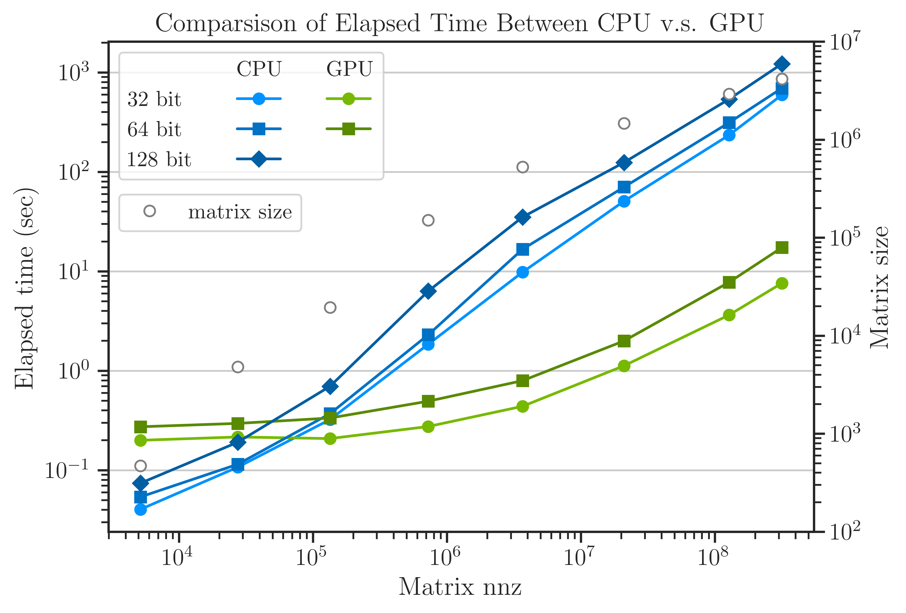
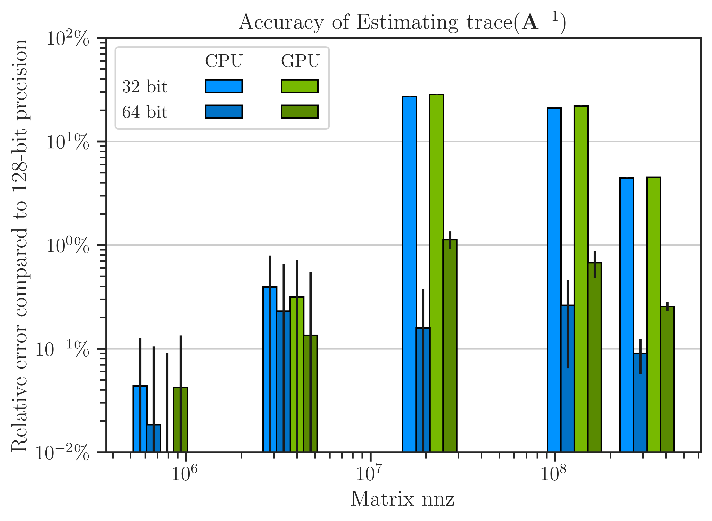
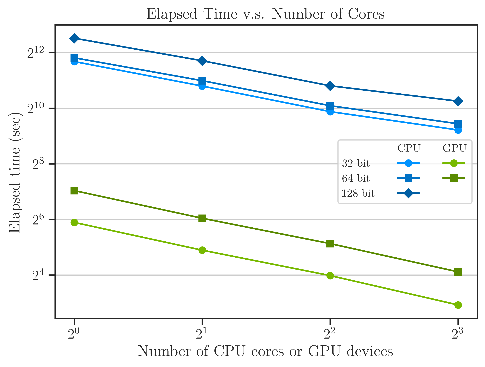

.. _perf-gpu:

Performance on GPU Farm
***********************

To test the performance on both GPU and compare with CPU, we run a benchmark task by compares

.. math::
    :label: traceinv
    
    \mathrm{trace}(\mathbf{A}^{-1}),

on several large matrices :math:`\mathbf{A}`.

Test Matrices
=============

The following sparse matrices from real applications chosen from `SparseSuite Matrix Collection <https://sparse.tamu.edu>`_. 

* `nos5 <https://sparse.tamu.edu/HB/nos5>`_
* `mhd4800b <https://sparse.tamu.edu/Bai/mhd4800b>`_
* `bodyy6 <https://sparse.tamu.edu/Pothen/bodyy6>`_
* `G2_circuit <https://sparse.tamu.edu/AMD/G2_circuit>`_
* `parabolic_fem <https://sparse.tamu.edu/Wissgott/parabolic_fem>`_
* `StocF-1465 <https://sparse.tamu.edu/Janna/StocF-1465>`_
* `Bump_2911 <https://sparse.tamu.edu/Janna/Bump_2911>`_
* `Queen_4147 <https://sparse.tamu.edu/Janna/Queen_4147>`_
  
All the above matrices are symmetric positive-definite. The last matrix (`Queen_4147`) is so large that 32-bit ``int`` type integers cannot hold the column and row indexing of this matrix. Rather, 32-bit ``unsigned int`` should be used. To do so, the |project| has to be compiled by exporting the environment variable:

::

    export UNSIGNED_LONG_INT=1

Alternatively, set ``UNSIGNED_LONG_INT=1`` in |def-use-cblas-2|_. By default, ``UNSIGNED_LONG_INT`` is ``0``.

Results
=======

.. |def-use-cblas-2|  replace:: ``/imate/_definitions/definition.h``
.. _def-use-cblas-2: https://github.com/ameli/imate/blob/main/imate/_definitions/definitions.h#L57

Considerations
==============

**Parameters:**

* In SLQ and Hutchinson methods, `min_num_samples` and `max_num_samples` are fixed to 200.
* In SLQ method, `lanczos_degree` is 80.
* All 24 cores of Intel Xeon E5-2670 v3 processor are used for all algorithms.
* The GPU results are obtained by GTX-3090 GPUs.

**Notes:**

* CPU computations have all 32, 64, and 128 but data types.
* GPU computations have ony 32, and 64 data types.

How to Reproduce Results
========================

Run the code both on CPU and GPU as follows.

Run on Local CPU
----------------

Run ``/benchmark/scripts/benchmark_speed.py`` by

::

    cd /benchmark/scripts
    python ./benchmark_speed.py -c

where ``-c`` runs the code on CPU on all 32-bit, 64-bit, and 128-bit data types.

The output is stored in `/benchnmark/pickle_results/benchmark_results_cpu.pickle`. Rename the results on CPU to

    /benchmark/pickle_results/benchmark_results_cpu_2670v3.pickle

Run on CPU Cluster
------------------

To run this script on a cluster with SLURM:

    cd jobfiles
    sbatch jobfile_benchmark_speed_cpu.sh

When submitting the jobs, make sure that the cpu is the same as the previous runs. For isnatnce, nodes on savio2 cluster between `n027` and `n150` are *Intel Xeon E5-2670 v3*.

Run on Local GPU
----------------

Run ``/benchmark/scripts/benchmark_speed.py`` by

::

    cd /benchmark/scripts
    module load cuda/11.2
    python ./benchmark_speed.py -g

where ``-g`` runs the code on CPU on all 32-bit, 64-bit, and 128-bit data types.

The output is stored in ``/benchnmark/pickle_results/benchmark_results_cpu.pickle``. Rename the results to

    /benchmark/pickle_results/benchmark_results_gpu_3090.pickle

Run on GPU Cluster
------------------

To run this script on a cluster with SLURM:

::

    cd jobfiles
    sbatch jobfile_benchmark_speed_gpu.sh

When submitting the jobs, make sure that the cpu is the same as the previous runs. For isnatnce, nodes on savio2 cluster between `n027` and `n150` are *Intel Xeon E5-2670 v3*.

Run on Cluster GPU Using Docker Image
--------------------------------------

On a virtual machine, it is better to install |project| using the it's `docker image <https://hub.docker.com/repository/docker/sameli/imate>`_.

* `Install docker <https://docs.docker.com/engine/install/ubuntu/>`_
* Set docker `without sudo <https://docs.docker.com/engine/install/linux-postinstall/>`_ password.
* Install `imate`:

  ::

      docker pull sameli/imate

* Follow instruction for `using docker's host's GPU <https://hub.docker.com/repository/docker/sameli/imate>`_.
